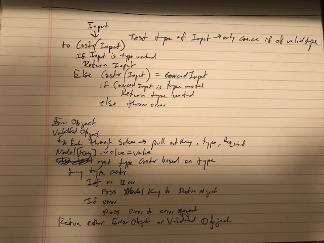
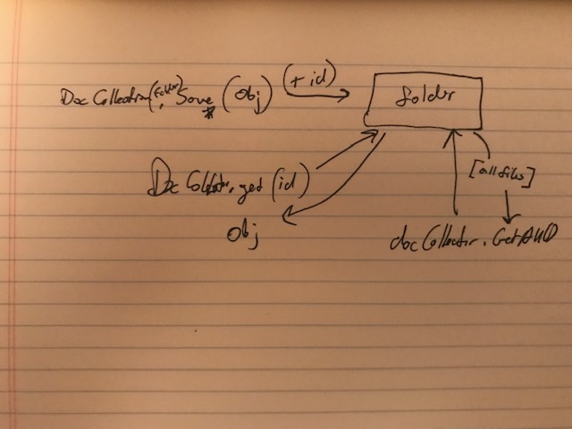

# LAB - 02

## Classes, Errors, Type Coercion/Async/

### Author: Joe Klause

### Links and Resources
* [submission PR](https://github.com/josephklause-401-advanced-javascript/lab-01/pull/3)
* [travis](https://travis-ci.com/josephklause-401-advanced-javascript/lab-01/builds/128578076)

#### Documentation
* [jsdoc](https://josephklause-401-advanced-javascript.github.io/lab-01/docs)

### Running the app

npm run start
    * starts node on index.js
    * will push a new file to destination.txt [folder](destination.txt) and console.log obj
    * will push a new file to [test-db](test-db) trumpet folder and person folder and console.log obj
npm run test
    * runs one iteration of test
npm run lint
    * runs linter
npm run test-watch
    * runs test once and re-runs whenever there is a change.
npm run jsdoc
    * Will create docs

#### UML

