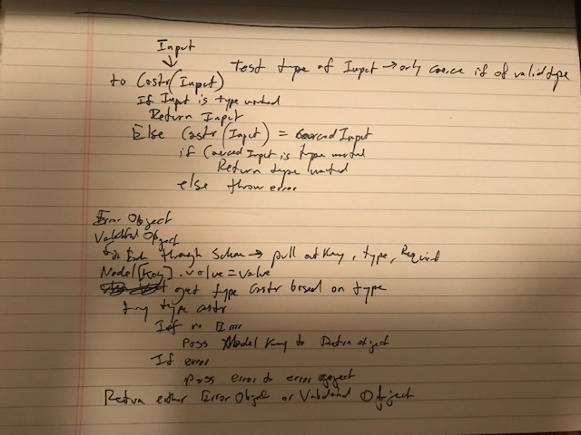

# LAB - 02

## Classes, Errors, Type Coercion

### Author: Joe Klause

### Links and Resources
* [submission PR](https://github.com/josephklause-401-advanced-javascript/lab-01/pull/2)
* [travis](https://travis-ci.com/josephklause-401-advanced-javascript/lab-01)

#### Documentation
* [jsdoc](https://josephklause-401-advanced-javascript.github.io/lab-01/docs)
This doesn't work because this branch isn't pushed to master yet.

### Running the app

#### npm run lint
  * Will run eslint.
#### npm run test
  * Will run jest tests just once.
#### npm run test-watch
  * Will run jest test continuously, listen for changes, and re-run when changes are made.
#### npm run jsdoc
  * Will create docs

#### UML

